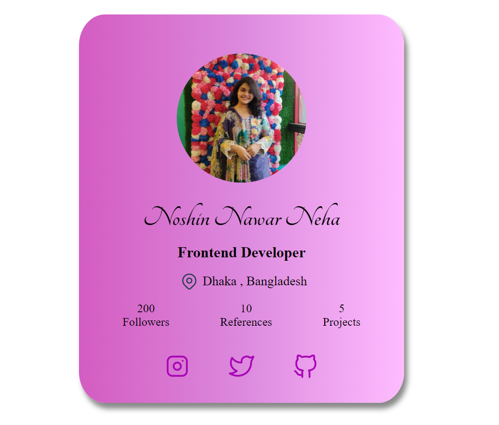

# Profile-UI-card

This is my responsive Profile UI card

## Table of contents

- [Overview](#overview)
  - [Screenshot](#screenshot)
  - [Links](#links)
  - [Built with](#built-with)
  

## Overview

### Screenshot

### Links

- Solution URL: [Here](https://github.com/nehanawar025/Profile-UI-card)
- Live Site URL: [Here](https://helpful-kangaroo-fa0e13.netlify.app/)

### Built with

- HTML5 
- CSS custom properties
- CSS (media query)

